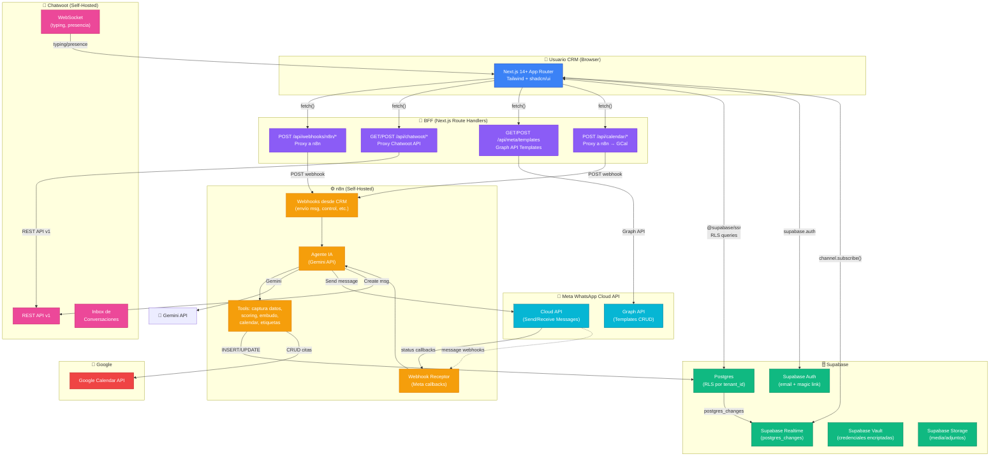
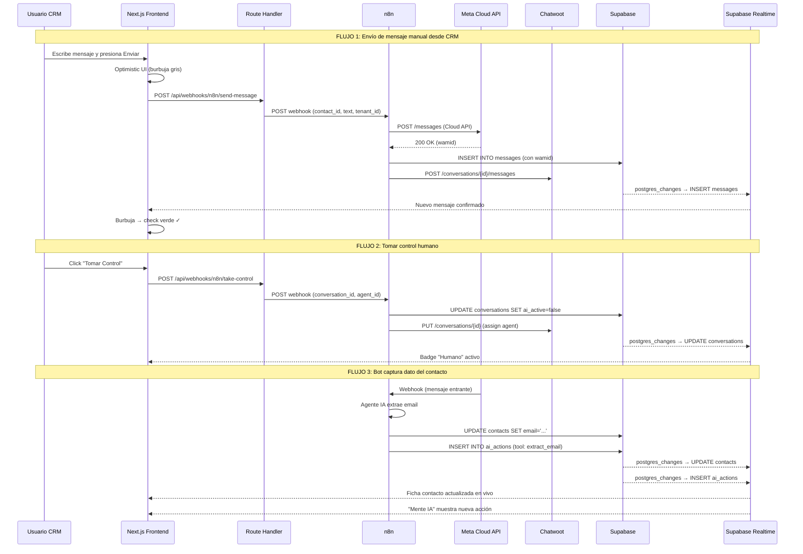

# TuContador CRM — Plan Arquitectónico Exhaustivo

---

## 1. Resumen Ejecutivo

TuContador CRM es un panel conversacional multi-tenant diseñado para PYMEs y agencias que automatizan atención al cliente vía WhatsApp Business. El CRM actúa exclusivamente como **capa de visualización y orquestación**: no procesa mensajes ni ejecuta lógica de negocio. La inteligencia vive en **n8n** (orquestación IA con Gemini), la mensajería pasa por **Chatwoot** (inbox) y la **Cloud API de Meta** (canal), mientras que **Supabase** centraliza el estado persistente con Realtime para reflejar cambios en vivo. El frontend (Next.js 14+ / App Router / Tailwind / shadcn/ui) consume estos sistemas mediante un BFF mínimo de route handlers que actúan como proxy seguro hacia webhooks de n8n, API de Chatwoot y Graph API de Meta para plantillas. La multi-tenancy se implementa por RLS a nivel de fila (`tenant_id`), con credenciales de servicios externos encriptadas vía Supabase Vault. El MVP cubre 6 módulos: Conversaciones, CRM (contactos + embudo), Agenda, Plantillas HSM, Reportes y Configuración.

---

## 2. Diagrama de Arquitectura



### Flujos Clave



---

## 3. Esquema de Datos Completo (SQL DDL para Supabase)

```sql
-- ================================================================
-- TUCONTADOR CRM - SCHEMA COMPLETO
-- Multi-tenant con RLS por tenant_id
-- ================================================================

-- Habilitar extensiones necesarias
CREATE EXTENSION IF NOT EXISTS "uuid-ossp";
CREATE EXTENSION IF NOT EXISTS "pgcrypto";
CREATE EXTENSION IF NOT EXISTS "vault" WITH SCHEMA vault;

-- ================================================================
-- 1. TENANTS (Organizaciones/Clientes de TuContador)
-- ================================================================
CREATE TABLE tenants (
    id UUID PRIMARY KEY DEFAULT gen_random_uuid(),
    name TEXT NOT NULL,                            -- "Contabilidad López S.A."
    slug TEXT NOT NULL UNIQUE,                     -- "contabilidad-lopez"
    logo_url TEXT,
    plan TEXT NOT NULL DEFAULT 'starter'
        CHECK (plan IN ('starter', 'professional', 'enterprise')),
    is_active BOOLEAN NOT NULL DEFAULT true,
    max_agents INTEGER NOT NULL DEFAULT 3,
    max_contacts INTEGER NOT NULL DEFAULT 1000,
    created_at TIMESTAMPTZ NOT NULL DEFAULT now(),
    updated_at TIMESTAMPTZ NOT NULL DEFAULT now()
);

-- ================================================================
-- 2. TENANT CREDENTIALS (encriptadas vía Vault)
-- Cada tenant almacena sus credenciales de servicios externos
-- ================================================================
CREATE TABLE tenant_credentials (
    id UUID PRIMARY KEY DEFAULT gen_random_uuid(),
    tenant_id UUID NOT NULL REFERENCES tenants(id) ON DELETE CASCADE,
    -- Meta WhatsApp
    waba_id TEXT,                                  -- WhatsApp Business Account ID
    phone_number_id TEXT,                          -- Phone Number ID de Meta
    meta_access_token TEXT,                        -- System User Token (encriptar con Vault)
    meta_webhook_verify_token TEXT,                -- Token de verificación webhook
    -- Chatwoot
    chatwoot_base_url TEXT,                        -- URL de la instancia Chatwoot
    chatwoot_api_token TEXT,                       -- API access token Chatwoot
    chatwoot_account_id INTEGER,                   -- Account ID en Chatwoot
    -- n8n
    n8n_base_url TEXT,                             -- URL de la instancia n8n
    n8n_webhook_secret TEXT,                       -- HMAC secret para firmar webhooks
    -- Google Calendar
    google_calendar_id TEXT,                       -- ID del calendario
    google_service_account_json TEXT,              -- SA key (encriptar con Vault)
    -- Metadata
    created_at TIMESTAMPTZ NOT NULL DEFAULT now(),
    updated_at TIMESTAMPTZ NOT NULL DEFAULT now(),
    UNIQUE(tenant_id)
);

-- NOTA: Las columnas meta_access_token, n8n_webhook_secret y
-- google_service_account_json deben encriptarse vía Supabase Vault.
-- Se crean vault secrets a nivel de aplicación y se referencian
-- por ID en la lógica de n8n o BFF. No se exponen al frontend.

-- ================================================================
-- 3. USERS (Usuarios del CRM, vinculados a Supabase Auth)
-- ================================================================
CREATE TABLE users (
    id UUID PRIMARY KEY REFERENCES auth.users(id) ON DELETE CASCADE,
    tenant_id UUID NOT NULL REFERENCES tenants(id) ON DELETE CASCADE,
    full_name TEXT NOT NULL,
    email TEXT NOT NULL,
    avatar_url TEXT,
    phone TEXT,
    role TEXT NOT NULL DEFAULT 'agent'
        CHECK (role IN ('owner', 'admin', 'agent', 'viewer')),
    is_active BOOLEAN NOT NULL DEFAULT true,
    chatwoot_agent_id INTEGER,                     -- ID del agente en Chatwoot
    last_seen_at TIMESTAMPTZ,
    created_at TIMESTAMPTZ NOT NULL DEFAULT now(),
    updated_at TIMESTAMPTZ NOT NULL DEFAULT now()
);

-- Índices
CREATE INDEX idx_users_tenant ON users(tenant_id);
CREATE INDEX idx_users_email ON users(email);
CREATE INDEX idx_users_role ON users(tenant_id, role);

-- ================================================================
-- 4. FUNNEL STAGES (Fases del embudo, configurables por tenant)
-- ================================================================
CREATE TABLE funnel_stages (
    id UUID PRIMARY KEY DEFAULT gen_random_uuid(),
    tenant_id UUID NOT NULL REFERENCES tenants(id) ON DELETE CASCADE,
    name TEXT NOT NULL,                            -- "Nuevo", "Contactado", etc.
    slug TEXT NOT NULL,                            -- "nuevo", "contactado"
    color TEXT NOT NULL DEFAULT '#6366f1',          -- Color hex para badges y Kanban
    position INTEGER NOT NULL DEFAULT 0,           -- Orden en el embudo
    is_won BOOLEAN NOT NULL DEFAULT false,         -- Marca como "ganado"
    is_lost BOOLEAN NOT NULL DEFAULT false,        -- Marca como "perdido"
    is_default BOOLEAN NOT NULL DEFAULT false,     -- Fase por defecto para nuevos contactos
    created_at TIMESTAMPTZ NOT NULL DEFAULT now(),
    UNIQUE(tenant_id, slug)
);

CREATE INDEX idx_funnel_stages_tenant ON funnel_stages(tenant_id, position);

-- ================================================================
-- 5. TAGS (Etiquetas, configurables por tenant)
-- ================================================================
CREATE TABLE tags (
    id UUID PRIMARY KEY DEFAULT gen_random_uuid(),
    tenant_id UUID NOT NULL REFERENCES tenants(id) ON DELETE CASCADE,
    name TEXT NOT NULL,                            -- "VIP", "Caliente", "Referido"
    color TEXT NOT NULL DEFAULT '#8b5cf6',
    created_at TIMESTAMPTZ NOT NULL DEFAULT now(),
    UNIQUE(tenant_id, name)
);

CREATE INDEX idx_tags_tenant ON tags(tenant_id);

-- ================================================================
-- 6. CONTACTS (Tabla maestra de contactos)
-- ================================================================
CREATE TABLE contacts (
    id UUID PRIMARY KEY DEFAULT gen_random_uuid(),
    tenant_id UUID NOT NULL REFERENCES tenants(id) ON DELETE CASCADE,
    -- Datos básicos
    first_name TEXT NOT NULL,
    last_name TEXT,
    phone TEXT,                                    -- Formato E.164: +573001234567
    email TEXT,
    company TEXT,
    job_title TEXT,
    city TEXT,
    country TEXT DEFAULT 'CO',
    -- Referencias externas
    chatwoot_contact_id INTEGER,                   -- ID en Chatwoot
    chatwoot_conversation_id INTEGER,              -- Conversation ID en Chatwoot
    wa_id TEXT,                                    -- WhatsApp ID (phone sin +)
    -- Estado del embudo
    funnel_stage_id UUID REFERENCES funnel_stages(id) ON DELETE SET NULL,
    lead_score INTEGER NOT NULL DEFAULT 0
        CHECK (lead_score >= 0 AND lead_score <= 100),
    -- Origen
    source TEXT NOT NULL DEFAULT 'manual'
        CHECK (source IN ('whatsapp', 'web', 'csv', 'manual', 'referral', 'campaign')),
    -- Asignación
    assigned_to UUID REFERENCES users(id) ON DELETE SET NULL,
    -- IA
    ai_active BOOLEAN NOT NULL DEFAULT true,       -- Si la IA está operando en esta conversación
    -- Ventana de 24h
    last_incoming_at TIMESTAMPTZ,                  -- Último mensaje entrante (para calcular ventana 24h)
    -- Metadata
    custom_fields JSONB DEFAULT '{}',
    notes TEXT,
    last_contacted_at TIMESTAMPTZ,
    created_at TIMESTAMPTZ NOT NULL DEFAULT now(),
    updated_at TIMESTAMPTZ NOT NULL DEFAULT now()
);

-- Índices
CREATE INDEX idx_contacts_tenant ON contacts(tenant_id);
CREATE INDEX idx_contacts_phone ON contacts(tenant_id, phone);
CREATE INDEX idx_contacts_email ON contacts(tenant_id, email);
CREATE INDEX idx_contacts_funnel ON contacts(tenant_id, funnel_stage_id);
CREATE INDEX idx_contacts_assigned ON contacts(tenant_id, assigned_to);
CREATE INDEX idx_contacts_score ON contacts(tenant_id, lead_score DESC);
CREATE INDEX idx_contacts_source ON contacts(tenant_id, source);
CREATE INDEX idx_contacts_ai_active ON contacts(tenant_id, ai_active);
CREATE INDEX idx_contacts_wa_id ON contacts(tenant_id, wa_id);
CREATE INDEX idx_contacts_chatwoot ON contacts(chatwoot_contact_id);
CREATE INDEX idx_contacts_updated ON contacts(updated_at DESC);

-- ================================================================
-- 7. CONTACT_TAGS (Relación muchos-a-muchos)
-- ================================================================
CREATE TABLE contact_tags (
    contact_id UUID NOT NULL REFERENCES contacts(id) ON DELETE CASCADE,
    tag_id UUID NOT NULL REFERENCES tags(id) ON DELETE CASCADE,
    created_at TIMESTAMPTZ NOT NULL DEFAULT now(),
    PRIMARY KEY (contact_id, tag_id)
);

CREATE INDEX idx_contact_tags_tag ON contact_tags(tag_id);

-- ================================================================
-- 8. CONVERSATIONS (Metadatos de conversación, espejo de Chatwoot)
-- Estado y metadata que necesitamos más allá de lo que Chatwoot da
-- ================================================================
CREATE TABLE conversations (
    id UUID PRIMARY KEY DEFAULT gen_random_uuid(),
    tenant_id UUID NOT NULL REFERENCES tenants(id) ON DELETE CASCADE,
    contact_id UUID NOT NULL REFERENCES contacts(id) ON DELETE CASCADE,
    chatwoot_conversation_id INTEGER,              -- ID en Chatwoot
    -- Estado
    status TEXT NOT NULL DEFAULT 'open'
        CHECK (status IN ('open', 'resolved', 'pending', 'snoozed')),
    ai_active BOOLEAN NOT NULL DEFAULT true,       -- IA controlando vs humano
    assigned_agent_id UUID REFERENCES users(id) ON DELETE SET NULL,
    -- Ventana de 24h
    window_expires_at TIMESTAMPTZ,                 -- Cuándo expira la ventana de 24h
    -- Métricas
    unread_count INTEGER NOT NULL DEFAULT 0,
    last_message_at TIMESTAMPTZ,
    last_message_preview TEXT,                     -- Preview del último mensaje
    last_message_direction TEXT
        CHECK (last_message_direction IN ('inbound', 'outbound')),
    -- Metadata
    created_at TIMESTAMPTZ NOT NULL DEFAULT now(),
    updated_at TIMESTAMPTZ NOT NULL DEFAULT now()
);

-- Índices
CREATE INDEX idx_conversations_tenant ON conversations(tenant_id);
CREATE INDEX idx_conversations_contact ON conversations(contact_id);
CREATE INDEX idx_conversations_status ON conversations(tenant_id, status);
CREATE INDEX idx_conversations_last_msg ON conversations(tenant_id, last_message_at DESC);
CREATE INDEX idx_conversations_unread ON conversations(tenant_id, unread_count DESC);
CREATE INDEX idx_conversations_assigned ON conversations(tenant_id, assigned_agent_id);
CREATE INDEX idx_conversations_ai ON conversations(tenant_id, ai_active);
CREATE INDEX idx_conversations_chatwoot ON conversations(chatwoot_conversation_id);

-- ================================================================
-- 9. MESSAGES (Copia local de mensajes para búsqueda rápida y
--    para alimentar la memoria del agente IA)
-- ================================================================
CREATE TABLE messages (
    id UUID PRIMARY KEY DEFAULT gen_random_uuid(),
    tenant_id UUID NOT NULL REFERENCES tenants(id) ON DELETE CASCADE,
    conversation_id UUID NOT NULL REFERENCES conversations(id) ON DELETE CASCADE,
    contact_id UUID NOT NULL REFERENCES contacts(id) ON DELETE CASCADE,
    -- Contenido
    content TEXT,                                  -- Texto del mensaje
    content_type TEXT NOT NULL DEFAULT 'text'
        CHECK (content_type IN ('text', 'image', 'audio', 'video',
               'document', 'sticker', 'location', 'contacts', 'template', 'reaction')),
    -- Dirección y autoría
    direction TEXT NOT NULL
        CHECK (direction IN ('inbound', 'outbound')),
    sender_type TEXT NOT NULL DEFAULT 'contact'
        CHECK (sender_type IN ('contact', 'agent', 'bot', 'system')),
    sender_id UUID,                                -- user.id si es agente, NULL si es contact/bot
    -- Media
    media_url TEXT,                                -- URL del archivo adjunto
    media_mime_type TEXT,
    media_filename TEXT,
    media_size_bytes INTEGER,
    -- Ubicación (si content_type = 'location')
    latitude DOUBLE PRECISION,
    longitude DOUBLE PRECISION,
    location_name TEXT,
    -- Template (si content_type = 'template')
    template_name TEXT,
    template_params JSONB,
    -- Reaction
    reaction_emoji TEXT,                           -- Si es reacción
    reacted_to_message_id UUID,                    -- A qué mensaje reacciona
    -- Referencias externas
    wa_message_id TEXT,                            -- wamid de Meta
    chatwoot_message_id INTEGER,
    -- Estado de entrega
    delivery_status TEXT DEFAULT 'sent'
        CHECK (delivery_status IN ('pending', 'sent', 'delivered', 'read', 'failed')),
    error_message TEXT,                            -- Si falló
    -- Timestamps
    created_at TIMESTAMPTZ NOT NULL DEFAULT now(),
    updated_at TIMESTAMPTZ NOT NULL DEFAULT now()
);

-- Índices
CREATE INDEX idx_messages_conversation ON messages(conversation_id, created_at);
CREATE INDEX idx_messages_tenant ON messages(tenant_id);
CREATE INDEX idx_messages_contact ON messages(contact_id, created_at);
CREATE INDEX idx_messages_wa_id ON messages(wa_message_id);
CREATE INDEX idx_messages_direction ON messages(conversation_id, direction);
CREATE INDEX idx_messages_created ON messages(created_at DESC);

-- ================================================================
-- 10. AI_ACTIONS ("Mente de la IA" - log de acciones del agente)
-- n8n escribe aquí en cada tool call del agente
-- ================================================================
CREATE TABLE ai_actions (
    id UUID PRIMARY KEY DEFAULT gen_random_uuid(),
    tenant_id UUID NOT NULL REFERENCES tenants(id) ON DELETE CASCADE,
    conversation_id UUID NOT NULL REFERENCES conversations(id) ON DELETE CASCADE,
    contact_id UUID NOT NULL REFERENCES contacts(id) ON DELETE CASCADE,
    -- Acción
    action_type TEXT NOT NULL,                     -- "extract_email", "schedule_appointment",
                                                   -- "qualify_lead", "change_stage", "send_response"
    tool_name TEXT,                                -- Nombre de la tool de n8n
    -- Resultado
    status TEXT NOT NULL DEFAULT 'success'
        CHECK (status IN ('success', 'failure', 'pending')),
    summary TEXT NOT NULL,                         -- "✓ Cita agendada exitosamente para 15/04..."
    details JSONB,                                 -- Datos completos de la tool call
    -- Contexto
    reasoning TEXT,                                -- "Razón: el cliente confirmó disponibilidad..."
    stage_before TEXT,                             -- Fase del embudo antes
    stage_after TEXT,                              -- Fase del embudo después
    data_captured JSONB,                           -- {"email": "juan@test.com"}
    -- Timestamps
    created_at TIMESTAMPTZ NOT NULL DEFAULT now()
);

-- Índices
CREATE INDEX idx_ai_actions_conversation ON ai_actions(conversation_id, created_at DESC);
CREATE INDEX idx_ai_actions_tenant ON ai_actions(tenant_id);
CREATE INDEX idx_ai_actions_contact ON ai_actions(contact_id);
CREATE INDEX idx_ai_actions_type ON ai_actions(action_type);

-- ================================================================
-- 11. APPOINTMENTS (Citas/Reuniones)
-- ================================================================
CREATE TABLE appointments (
    id UUID PRIMARY KEY DEFAULT gen_random_uuid(),
    tenant_id UUID NOT NULL REFERENCES tenants(id) ON DELETE CASCADE,
    contact_id UUID REFERENCES contacts(id) ON DELETE SET NULL,
    assigned_to UUID REFERENCES users(id) ON DELETE SET NULL,
    -- Detalles
    title TEXT NOT NULL,
    description TEXT,
    location TEXT,                                 -- "Google Meet", "Oficina", URL de Zoom
    -- Tiempos
    start_time TIMESTAMPTZ NOT NULL,
    end_time TIMESTAMPTZ NOT NULL,
    timezone TEXT NOT NULL DEFAULT 'America/Bogota',
    -- Estado
    status TEXT NOT NULL DEFAULT 'scheduled'
        CHECK (status IN ('scheduled', 'confirmed', 'completed',
               'cancelled', 'no_show', 'rescheduled')),
    -- Google Calendar sync
    google_event_id TEXT,                          -- ID del evento en Google Calendar
    google_calendar_id TEXT,                       -- ID del calendario de Google
    google_meet_link TEXT,                         -- Link de Google Meet si aplica
    -- Origen
    created_by TEXT NOT NULL DEFAULT 'manual'
        CHECK (created_by IN ('bot', 'manual', 'import')),
    created_by_user_id UUID REFERENCES users(id) ON DELETE SET NULL,
    -- Metadata
    notes TEXT,
    reminder_sent BOOLEAN NOT NULL DEFAULT false,
    created_at TIMESTAMPTZ NOT NULL DEFAULT now(),
    updated_at TIMESTAMPTZ NOT NULL DEFAULT now()
);

-- Índices
CREATE INDEX idx_appointments_tenant ON appointments(tenant_id);
CREATE INDEX idx_appointments_contact ON appointments(contact_id);
CREATE INDEX idx_appointments_assigned ON appointments(assigned_to);
CREATE INDEX idx_appointments_start ON appointments(tenant_id, start_time);
CREATE INDEX idx_appointments_status ON appointments(tenant_id, status);
CREATE INDEX idx_appointments_google ON appointments(google_event_id);

-- ================================================================
-- 12. HSM_TEMPLATES (Cache local de templates de Meta)
-- ================================================================
CREATE TABLE hsm_templates (
    id UUID PRIMARY KEY DEFAULT gen_random_uuid(),
    tenant_id UUID NOT NULL REFERENCES tenants(id) ON DELETE CASCADE,
    -- Meta data
    meta_template_id TEXT NOT NULL,                -- ID de Meta
    name TEXT NOT NULL,
    language TEXT NOT NULL DEFAULT 'es',
    category TEXT NOT NULL
        CHECK (category IN ('MARKETING', 'UTILITY', 'AUTHENTICATION')),
    status TEXT NOT NULL DEFAULT 'PENDING'
        CHECK (status IN ('APPROVED', 'PENDING', 'REJECTED', 'PAUSED', 'DISABLED')),
    -- Estructura
    header_type TEXT CHECK (header_type IN ('TEXT', 'IMAGE', 'VIDEO', 'DOCUMENT', 'NONE')),
    header_text TEXT,
    body_text TEXT NOT NULL,
    footer_text TEXT,
    buttons JSONB,                                 -- Array de botones [{type, text, url/phone}]
    -- Variables
    variables_count INTEGER NOT NULL DEFAULT 0,
    example_values JSONB,                          -- Valores de ejemplo para preview
    -- Metadata
    last_synced_at TIMESTAMPTZ,
    created_at TIMESTAMPTZ NOT NULL DEFAULT now(),
    updated_at TIMESTAMPTZ NOT NULL DEFAULT now(),
    UNIQUE(tenant_id, meta_template_id)
);

CREATE INDEX idx_hsm_templates_tenant ON hsm_templates(tenant_id);
CREATE INDEX idx_hsm_templates_status ON hsm_templates(tenant_id, status);
CREATE INDEX idx_hsm_templates_category ON hsm_templates(tenant_id, category);

-- ================================================================
-- 13. CAMPAIGNS (Campañas de envío masivo de plantillas)
-- ================================================================
CREATE TABLE campaigns (
    id UUID PRIMARY KEY DEFAULT gen_random_uuid(),
    tenant_id UUID NOT NULL REFERENCES tenants(id) ON DELETE CASCADE,
    name TEXT NOT NULL,
    description TEXT,
    -- Template
    template_id UUID REFERENCES hsm_templates(id) ON DELETE SET NULL,
    template_name TEXT NOT NULL,                   -- Redundante para display rápido
    template_variables JSONB,                      -- Mapping de variables a campos del contacto
    -- Segmentación
    segment_filters JSONB NOT NULL DEFAULT '{}',   -- Filtros aplicados para seleccionar contactos
    total_contacts INTEGER NOT NULL DEFAULT 0,     -- Contactos en el segmento
    -- Estado
    status TEXT NOT NULL DEFAULT 'draft'
        CHECK (status IN ('draft', 'scheduled', 'sending', 'completed', 'failed', 'cancelled')),
    scheduled_at TIMESTAMPTZ,
    started_at TIMESTAMPTZ,
    completed_at TIMESTAMPTZ,
    -- Métricas (actualizadas por n8n)
    sent_count INTEGER NOT NULL DEFAULT 0,
    delivered_count INTEGER NOT NULL DEFAULT 0,
    read_count INTEGER NOT NULL DEFAULT 0,
    replied_count INTEGER NOT NULL DEFAULT 0,
    failed_count INTEGER NOT NULL DEFAULT 0,
    -- Creador
    created_by UUID REFERENCES users(id) ON DELETE SET NULL,
    created_at TIMESTAMPTZ NOT NULL DEFAULT now(),
    updated_at TIMESTAMPTZ NOT NULL DEFAULT now()
);

CREATE INDEX idx_campaigns_tenant ON campaigns(tenant_id);
CREATE INDEX idx_campaigns_status ON campaigns(tenant_id, status);
CREATE INDEX idx_campaigns_created ON campaigns(created_at DESC);

-- ================================================================
-- 14. CAMPAIGN_MESSAGES (Log de cada envío individual de campaña)
-- ================================================================
CREATE TABLE campaign_messages (
    id UUID PRIMARY KEY DEFAULT gen_random_uuid(),
    tenant_id UUID NOT NULL REFERENCES tenants(id) ON DELETE CASCADE,
    campaign_id UUID NOT NULL REFERENCES campaigns(id) ON DELETE CASCADE,
    contact_id UUID NOT NULL REFERENCES contacts(id) ON DELETE CASCADE,
    -- Estado
    status TEXT NOT NULL DEFAULT 'pending'
        CHECK (status IN ('pending', 'sent', 'delivered', 'read', 'replied', 'failed')),
    -- Meta IDs
    wa_message_id TEXT,                            -- wamid
    error_code TEXT,
    error_message TEXT,
    -- Timestamps
    sent_at TIMESTAMPTZ,
    delivered_at TIMESTAMPTZ,
    read_at TIMESTAMPTZ,
    replied_at TIMESTAMPTZ,
    created_at TIMESTAMPTZ NOT NULL DEFAULT now()
);

CREATE INDEX idx_campaign_msgs_campaign ON campaign_messages(campaign_id);
CREATE INDEX idx_campaign_msgs_contact ON campaign_messages(contact_id);
CREATE INDEX idx_campaign_msgs_status ON campaign_messages(campaign_id, status);

-- ================================================================
-- 15. PHASE_TRANSITIONS (Historial de cambios de fase)
-- ================================================================
CREATE TABLE phase_transitions (
    id UUID PRIMARY KEY DEFAULT gen_random_uuid(),
    tenant_id UUID NOT NULL REFERENCES tenants(id) ON DELETE CASCADE,
    contact_id UUID NOT NULL REFERENCES contacts(id) ON DELETE CASCADE,
    previous_stage_id UUID REFERENCES funnel_stages(id),
    new_stage_id UUID REFERENCES funnel_stages(id),
    previous_stage_name TEXT,                      -- Desnormalizado para historial
    new_stage_name TEXT,
    -- Contexto
    reason TEXT NOT NULL DEFAULT 'manual'
        CHECK (reason IN ('automatic', 'manual', 'bot', 'campaign')),
    trigger_description TEXT,                      -- "Bot calificó lead como interesado"
    changed_by UUID REFERENCES users(id) ON DELETE SET NULL,
    created_at TIMESTAMPTZ NOT NULL DEFAULT now()
);

CREATE INDEX idx_phase_transitions_contact ON phase_transitions(contact_id, created_at DESC);
CREATE INDEX idx_phase_transitions_tenant ON phase_transitions(tenant_id);

-- ================================================================
-- 16. ACTIVITY_LOG (Timeline de actividad del contacto)
-- ================================================================
CREATE TABLE activity_log (
    id UUID PRIMARY KEY DEFAULT gen_random_uuid(),
    tenant_id UUID NOT NULL REFERENCES tenants(id) ON DELETE CASCADE,
    contact_id UUID NOT NULL REFERENCES contacts(id) ON DELETE CASCADE,
    -- Actividad
    activity_type TEXT NOT NULL,                   -- "message_sent", "phase_changed",
                                                   -- "appointment_created", "tag_added",
                                                   -- "note_added", "lead_score_changed",
                                                   -- "ai_action", "human_takeover"
    channel TEXT NOT NULL DEFAULT 'system'
        CHECK (channel IN ('whatsapp', 'system', 'manual', 'bot')),
    description TEXT NOT NULL,
    metadata JSONB,
    -- Actor
    performed_by UUID REFERENCES users(id) ON DELETE SET NULL,
    performed_by_name TEXT,                        -- "Bot IA", "Juan Pérez"
    created_at TIMESTAMPTZ NOT NULL DEFAULT now()
);

CREATE INDEX idx_activity_log_contact ON activity_log(contact_id, created_at DESC);
CREATE INDEX idx_activity_log_tenant ON activity_log(tenant_id, created_at DESC);
CREATE INDEX idx_activity_log_type ON activity_log(activity_type);

-- ================================================================
-- 17. DAILY_METRICS (Métricas agregadas por día, escritas por n8n)
-- ================================================================
CREATE TABLE daily_metrics (
    id UUID PRIMARY KEY DEFAULT gen_random_uuid(),
    tenant_id UUID NOT NULL REFERENCES tenants(id) ON DELETE CASCADE,
    date DATE NOT NULL,
    -- Conversaciones
    conversations_total INTEGER NOT NULL DEFAULT 0,
    conversations_new INTEGER NOT NULL DEFAULT 0,
    conversations_resolved INTEGER NOT NULL DEFAULT 0,
    -- Mensajes
    messages_inbound INTEGER NOT NULL DEFAULT 0,
    messages_outbound INTEGER NOT NULL DEFAULT 0,
    messages_by_bot INTEGER NOT NULL DEFAULT 0,
    messages_by_human INTEGER NOT NULL DEFAULT 0,
    -- Bot performance
    bot_response_avg_seconds DOUBLE PRECISION,
    bot_handoff_count INTEGER NOT NULL DEFAULT 0,  -- Veces que se pasó a humano
    -- Embudo
    leads_new INTEGER NOT NULL DEFAULT 0,
    leads_qualified INTEGER NOT NULL DEFAULT 0,
    leads_won INTEGER NOT NULL DEFAULT 0,
    leads_lost INTEGER NOT NULL DEFAULT 0,
    -- Citas
    appointments_booked INTEGER NOT NULL DEFAULT 0,
    appointments_completed INTEGER NOT NULL DEFAULT 0,
    appointments_no_show INTEGER NOT NULL DEFAULT 0,
    -- Campañas
    campaigns_sent INTEGER NOT NULL DEFAULT 0,
    campaigns_delivered INTEGER NOT NULL DEFAULT 0,
    campaigns_read INTEGER NOT NULL DEFAULT 0,
    campaigns_replied INTEGER NOT NULL DEFAULT 0,
    --
    created_at TIMESTAMPTZ NOT NULL DEFAULT now(),
    UNIQUE(tenant_id, date)
);

CREATE INDEX idx_daily_metrics_tenant_date ON daily_metrics(tenant_id, date DESC);

-- ================================================================
-- 18. CONTACT_NOTES (Notas internas sobre contactos)
-- ================================================================
CREATE TABLE contact_notes (
    id UUID PRIMARY KEY DEFAULT gen_random_uuid(),
    tenant_id UUID NOT NULL REFERENCES tenants(id) ON DELETE CASCADE,
    contact_id UUID NOT NULL REFERENCES contacts(id) ON DELETE CASCADE,
    content TEXT NOT NULL,
    created_by UUID REFERENCES users(id) ON DELETE SET NULL,
    created_at TIMESTAMPTZ NOT NULL DEFAULT now(),
    updated_at TIMESTAMPTZ NOT NULL DEFAULT now()
);

CREATE INDEX idx_contact_notes_contact ON contact_notes(contact_id, created_at DESC);

-- ================================================================
-- HABILITAR REALTIME EN TABLAS CLAVE
-- ================================================================
ALTER PUBLICATION supabase_realtime ADD TABLE contacts;
ALTER PUBLICATION supabase_realtime ADD TABLE conversations;
ALTER PUBLICATION supabase_realtime ADD TABLE messages;
ALTER PUBLICATION supabase_realtime ADD TABLE ai_actions;
ALTER PUBLICATION supabase_realtime ADD TABLE appointments;
ALTER PUBLICATION supabase_realtime ADD TABLE phase_transitions;

-- ================================================================
-- ROW LEVEL SECURITY (RLS) — Multi-tenant
-- ================================================================

-- Helper function: obtener tenant_id del usuario actual
CREATE OR REPLACE FUNCTION get_user_tenant_id()
RETURNS UUID AS $$
    SELECT tenant_id FROM users WHERE id = auth.uid()
$$ LANGUAGE sql SECURITY DEFINER STABLE;

-- Helper function: obtener rol del usuario actual
CREATE OR REPLACE FUNCTION get_user_role()
RETURNS TEXT AS $$
    SELECT role FROM users WHERE id = auth.uid()
$$ LANGUAGE sql SECURITY DEFINER STABLE;

-- ---- Habilitar RLS en todas las tablas ----
ALTER TABLE tenants ENABLE ROW LEVEL SECURITY;
ALTER TABLE tenant_credentials ENABLE ROW LEVEL SECURITY;
ALTER TABLE users ENABLE ROW LEVEL SECURITY;
ALTER TABLE funnel_stages ENABLE ROW LEVEL SECURITY;
ALTER TABLE tags ENABLE ROW LEVEL SECURITY;
ALTER TABLE contacts ENABLE ROW LEVEL SECURITY;
ALTER TABLE contact_tags ENABLE ROW LEVEL SECURITY;
ALTER TABLE conversations ENABLE ROW LEVEL SECURITY;
ALTER TABLE messages ENABLE ROW LEVEL SECURITY;
ALTER TABLE ai_actions ENABLE ROW LEVEL SECURITY;
ALTER TABLE appointments ENABLE ROW LEVEL SECURITY;
ALTER TABLE hsm_templates ENABLE ROW LEVEL SECURITY;
ALTER TABLE campaigns ENABLE ROW LEVEL SECURITY;
ALTER TABLE campaign_messages ENABLE ROW LEVEL SECURITY;
ALTER TABLE phase_transitions ENABLE ROW LEVEL SECURITY;
ALTER TABLE activity_log ENABLE ROW LEVEL SECURITY;
ALTER TABLE daily_metrics ENABLE ROW LEVEL SECURITY;
ALTER TABLE contact_notes ENABLE ROW LEVEL SECURITY;

-- ---- TENANTS ----
CREATE POLICY "tenant_select" ON tenants FOR SELECT TO authenticated
    USING (id = get_user_tenant_id());

CREATE POLICY "tenant_update" ON tenants FOR UPDATE TO authenticated
    USING (id = get_user_tenant_id() AND get_user_role() IN ('owner', 'admin'))
    WITH CHECK (id = get_user_tenant_id());

-- ---- TENANT CREDENTIALS ----
-- Solo owner y admin pueden ver credenciales
CREATE POLICY "creds_select" ON tenant_credentials FOR SELECT TO authenticated
    USING (tenant_id = get_user_tenant_id() AND get_user_role() IN ('owner', 'admin'));

CREATE POLICY "creds_update" ON tenant_credentials FOR UPDATE TO authenticated
    USING (tenant_id = get_user_tenant_id() AND get_user_role() = 'owner')
    WITH CHECK (tenant_id = get_user_tenant_id());

-- ---- USERS ----
CREATE POLICY "users_select" ON users FOR SELECT TO authenticated
    USING (tenant_id = get_user_tenant_id());

CREATE POLICY "users_insert" ON users FOR INSERT TO authenticated
    WITH CHECK (tenant_id = get_user_tenant_id() AND get_user_role() IN ('owner', 'admin'));

CREATE POLICY "users_update" ON users FOR UPDATE TO authenticated
    USING (tenant_id = get_user_tenant_id() AND
           (id = auth.uid() OR get_user_role() IN ('owner', 'admin')))
    WITH CHECK (tenant_id = get_user_tenant_id());

-- ---- TABLAS CON tenant_id (patrón genérico) ----
-- Aplicar a: funnel_stages, tags, contacts, conversations, messages,
-- ai_actions, appointments, hsm_templates, campaigns, campaign_messages,
-- phase_transitions, activity_log, daily_metrics, contact_notes

-- SELECT: cualquier usuario autenticado del mismo tenant
-- INSERT: agent, admin, owner (no viewer)
-- UPDATE: agent, admin, owner
-- DELETE: solo admin, owner

-- Macro-aplicación por tabla (ejemplo con contacts, replicar para todas):

CREATE POLICY "contacts_select" ON contacts FOR SELECT TO authenticated
    USING (tenant_id = get_user_tenant_id());
CREATE POLICY "contacts_insert" ON contacts FOR INSERT TO authenticated
    WITH CHECK (tenant_id = get_user_tenant_id() AND get_user_role() != 'viewer');
CREATE POLICY "contacts_update" ON contacts FOR UPDATE TO authenticated
    USING (tenant_id = get_user_tenant_id() AND get_user_role() != 'viewer')
    WITH CHECK (tenant_id = get_user_tenant_id());
CREATE POLICY "contacts_delete" ON contacts FOR DELETE TO authenticated
    USING (tenant_id = get_user_tenant_id() AND get_user_role() IN ('owner', 'admin'));

-- Repetir este patrón para cada tabla con tenant_id:
-- funnel_stages, tags, contact_tags, conversations, messages,
-- ai_actions, appointments, hsm_templates, campaigns, campaign_messages,
-- phase_transitions, activity_log, daily_metrics, contact_notes

-- ---- SERVICE ROLE para n8n ----
-- n8n usará la service_role key de Supabase para escribir
-- directamente, bypassing RLS. Esto es necesario porque n8n
-- no tiene un auth.uid() — actúa como sistema.
-- Alternativa: crear un pg_role custom "n8n_service" con permisos granulares.

-- ================================================================
-- TRIGGERS
-- ================================================================

-- Auto-actualizar updated_at
CREATE OR REPLACE FUNCTION update_modified_column()
RETURNS TRIGGER AS $$
BEGIN
    NEW.updated_at = now();
    RETURN NEW;
END;
$$ LANGUAGE plpgsql;

CREATE TRIGGER set_updated_at BEFORE UPDATE ON tenants
    FOR EACH ROW EXECUTE FUNCTION update_modified_column();
CREATE TRIGGER set_updated_at BEFORE UPDATE ON users
    FOR EACH ROW EXECUTE FUNCTION update_modified_column();
CREATE TRIGGER set_updated_at BEFORE UPDATE ON contacts
    FOR EACH ROW EXECUTE FUNCTION update_modified_column();
CREATE TRIGGER set_updated_at BEFORE UPDATE ON conversations
    FOR EACH ROW EXECUTE FUNCTION update_modified_column();
CREATE TRIGGER set_updated_at BEFORE UPDATE ON messages
    FOR EACH ROW EXECUTE FUNCTION update_modified_column();
CREATE TRIGGER set_updated_at BEFORE UPDATE ON appointments
    FOR EACH ROW EXECUTE FUNCTION update_modified_column();
CREATE TRIGGER set_updated_at BEFORE UPDATE ON hsm_templates
    FOR EACH ROW EXECUTE FUNCTION update_modified_column();
CREATE TRIGGER set_updated_at BEFORE UPDATE ON campaigns
    FOR EACH ROW EXECUTE FUNCTION update_modified_column();
CREATE TRIGGER set_updated_at BEFORE UPDATE ON contact_notes
    FOR EACH ROW EXECUTE FUNCTION update_modified_column();

-- Trigger: al mover contacto de fase, insertar en phase_transitions
CREATE OR REPLACE FUNCTION log_phase_transition()
RETURNS TRIGGER AS $$
BEGIN
    IF OLD.funnel_stage_id IS DISTINCT FROM NEW.funnel_stage_id THEN
        INSERT INTO phase_transitions (tenant_id, contact_id, previous_stage_id, new_stage_id, reason)
        VALUES (NEW.tenant_id, NEW.id, OLD.funnel_stage_id, NEW.funnel_stage_id, 'manual');
    END IF;
    RETURN NEW;
END;
$$ LANGUAGE plpgsql;

CREATE TRIGGER trigger_phase_transition AFTER UPDATE ON contacts
    FOR EACH ROW EXECUTE FUNCTION log_phase_transition();
```

---

## 4. Estructura de Carpetas del Proyecto Next.js

```
tucontador-crm/
├── .env.local                          # Variables de entorno
├── .env.example                        # Template con todas las variables necesarias
├── .gitignore
├── next.config.ts
├── package.json
├── postcss.config.mjs
├── tailwind.config.ts
├── tsconfig.json
├── components.json                     # Config de shadcn/ui
├── middleware.ts                        # Auth middleware (Supabase SSR)
│
├── supabase/
│   ├── schema.sql                      # DDL completo (sección 3)
│   ├── seed.sql                        # Datos de prueba
│   └── migrations/                     # Migraciones incrementales
│
├── public/
│   ├── logo.svg
│   ├── favicon.ico
│   └── images/
│
├── app/
│   ├── layout.tsx                      # Root layout (providers, fonts, metadata)
│   ├── page.tsx                        # Redirect a /login o /conversations
│   ├── globals.css                     # Estilos base + tokens de diseño
│   │
│   ├── (auth)/
│   │   ├── layout.tsx                  # Auth layout (centrado, branding)
│   │   ├── login/
│   │   │   └── page.tsx                # Login (email + magic link)
│   │   ├── signup/
│   │   │   └── page.tsx                # Registro (invitación)
│   │   └── auth/
│   │       └── callback/
│   │           └── route.ts            # Callback OAuth / Magic Link
│   │
│   ├── (dashboard)/
│   │   ├── layout.tsx                  # Dashboard shell (sidebar + topbar)
│   │   │
│   │   ├── conversations/
│   │   │   ├── page.tsx                # Lista conversaciones + chat + ficha contacto
│   │   │   └── [conversationId]/
│   │   │       └── page.tsx            # Deep-link a conversación específica
│   │   │
│   │   ├── contacts/
│   │   │   ├── page.tsx                # Vista tabla + Kanban con toggle
│   │   │   ├── import/
│   │   │   │   └── page.tsx            # Importación masiva CSV
│   │   │   └── [contactId]/
│   │   │       └── page.tsx            # Detalle de contacto completo
│   │   │
│   │   ├── calendar/
│   │   │   └── page.tsx                # Calendario semanal/mensual
│   │   │
│   │   ├── templates/
│   │   │   ├── page.tsx                # Lista de plantillas HSM
│   │   │   ├── new/
│   │   │   │   └── page.tsx            # Crear nueva plantilla
│   │   │   └── campaigns/
│   │   │       ├── page.tsx            # Lista de campañas
│   │   │       ├── new/
│   │   │       │   └── page.tsx        # Crear nueva campaña de envío masivo
│   │   │       └── [campaignId]/
│   │   │           └── page.tsx        # Detalle de campaña con métricas
│   │   │
│   │   ├── reports/
│   │   │   └── page.tsx                # Dashboard de reportes y métricas
│   │   │
│   │   └── settings/
│   │       ├── page.tsx                # Settings overview / redirect
│   │       ├── general/
│   │       │   └── page.tsx            # Config general del tenant
│   │       ├── users/
│   │       │   └── page.tsx            # Gestión de usuarios y roles
│   │       ├── tags/
│   │       │   └── page.tsx            # CRUD de etiquetas
│   │       ├── funnel/
│   │       │   └── page.tsx            # CRUD de fases del embudo
│   │       └── integrations/
│   │           └── page.tsx            # Config de credenciales (Meta, Chatwoot, n8n)
│   │
│   └── api/
│       ├── webhooks/
│       │   └── n8n/
│       │       ├── send-message/
│       │       │   └── route.ts        # Proxy: enviar mensaje vía n8n
│       │       ├── take-control/
│       │       │   └── route.ts        # Proxy: tomar control humano
│       │       ├── release-control/
│       │       │   └── route.ts        # Proxy: devolver control a IA
│       │       ├── move-stage/
│       │       │   └── route.ts        # Proxy: mover contacto de fase
│       │       └── send-campaign/
│       │           └── route.ts        # Proxy: disparar envío masivo
│       │
│       ├── chatwoot/
│       │   ├── conversations/
│       │   │   └── route.ts            # Proxy: listar/gestionar conversaciones
│       │   ├── messages/
│       │   │   └── route.ts            # Proxy: listar mensajes de conversación
│       │   └── sso/
│       │       └── route.ts            # Generar URL SSO de Chatwoot
│       │
│       ├── meta/
│       │   └── templates/
│       │       └── route.ts            # CRUD de plantillas HSM (Graph API)
│       │
│       └── calendar/
│           ├── events/
│           │   └── route.ts            # CRUD citas → webhook n8n → GCal
│           └── sync/
│               └── route.ts            # Forzar sincronización con GCal
│
├── components/
│   ├── ui/                             # shadcn/ui components (auto-generated)
│   │   ├── button.tsx
│   │   ├── input.tsx
│   │   ├── dialog.tsx
│   │   ├── dropdown-menu.tsx
│   │   ├── badge.tsx
│   │   ├── avatar.tsx
│   │   ├── card.tsx
│   │   ├── table.tsx
│   │   ├── tabs.tsx
│   │   ├── tooltip.tsx
│   │   ├── popover.tsx
│   │   ├── select.tsx
│   │   ├── textarea.tsx
│   │   ├── skeleton.tsx
│   │   ├── scroll-area.tsx
│   │   ├── sheet.tsx
│   │   ├── slider.tsx
│   │   ├── progress.tsx
│   │   ├── calendar.tsx                # Date picker component
│   │   └── command.tsx                 # Command palette
│   │
│   ├── layout/
│   │   ├── sidebar.tsx                 # Sidebar principal con navegación
│   │   ├── topbar.tsx                  # Barra superior con búsqueda + perfil
│   │   ├── mobile-nav.tsx              # Navegación móvil
│   │   └── theme-toggle.tsx            # Dark/light mode
│   │
│   ├── conversations/
│   │   ├── conversation-list.tsx       # Lista lateral de conversaciones
│   │   ├── conversation-item.tsx       # Item individual (avatar, preview, badge)
│   │   ├── conversation-filters.tsx    # Filtros (etiqueta, fase, asignado, IA)
│   │   ├── chat-view.tsx              # Vista principal del chat
│   │   ├── message-bubble.tsx          # Burbuja de mensaje (in/out)
│   │   ├── message-audio.tsx           # Reproductor de audio inline
│   │   ├── message-media.tsx           # Preview de imagen/video/documento
│   │   ├── message-location.tsx        # Mapa de ubicación
│   │   ├── message-template.tsx        # Render de mensaje de plantilla
│   │   ├── composer.tsx                # Input de mensaje con adjuntos
│   │   ├── audio-recorder.tsx          # Grabador de audio (MediaRecorder API)
│   │   ├── template-selector.tsx       # Modal de selección de plantilla HSM
│   │   ├── template-preview.tsx        # Preview de plantilla con variables
│   │   ├── contact-panel.tsx           # Panel lateral derecho (ficha contacto)
│   │   ├── ai-mind-panel.tsx           # Panel "Mente de la IA"
│   │   ├── ai-action-item.tsx          # Item de acción de IA en timeline
│   │   ├── take-control-button.tsx     # Botón tomar/devolver control
│   │   └── window-indicator.tsx        # Indicador ventana 24h con countdown
│   │
│   ├── contacts/
│   │   ├── contacts-table.tsx          # Data table (estilo Airtable)
│   │   ├── contacts-kanban.tsx         # Vista Kanban con drag & drop
│   │   ├── kanban-column.tsx           # Columna del Kanban
│   │   ├── kanban-card.tsx             # Card de contacto en Kanban
│   │   ├── contact-detail.tsx          # Detalle completo del contacto
│   │   ├── contact-timeline.tsx        # Timeline de actividad
│   │   ├── contact-filters.tsx         # Panel de filtros avanzados
│   │   ├── contact-import-wizard.tsx   # Wizard de importación CSV
│   │   ├── contact-export.tsx          # Botón/lógica de exportación CSV
│   │   ├── lead-score-bar.tsx          # Barra visual 0-100 de lead score
│   │   └── contact-chatwoot-sync.tsx   # Sincronización con Chatwoot
│   │
│   ├── calendar/
│   │   ├── calendar-view.tsx           # Wrapper de FullCalendar/react-big-calendar
│   │   ├── event-dialog.tsx            # Modal crear/editar cita
│   │   ├── event-card.tsx              # Card de evento en calendario
│   │   └── google-sync-status.tsx      # Indicador de sincronización
│   │
│   ├── templates/
│   │   ├── template-list.tsx           # Lista de plantillas HSM
│   │   ├── template-form.tsx           # Formulario crear/editar plantilla
│   │   ├── template-card.tsx           # Card preview de plantilla
│   │   └── template-variable-input.tsx # Input para variables {{1}}, {{2}}
│   │
│   ├── campaigns/
│   │   ├── campaign-list.tsx           # Lista de campañas
│   │   ├── campaign-form.tsx           # Form de nueva campaña
│   │   ├── campaign-metrics.tsx        # Métricas de campaña (donut, barras)
│   │   ├── segment-builder.tsx         # Constructor de segmento de contactos
│   │   └── campaign-detail.tsx         # Detalle con log de envíos
│   │
│   ├── reports/
│   │   ├── overview-cards.tsx          # Cards resumen (KPIs)
│   │   ├── conversations-chart.tsx     # Chart conversaciones por día
│   │   ├── funnel-chart.tsx            # Chart embudo de conversión
│   │   ├── bot-performance.tsx         # Métricas de rendimiento del bot
│   │   ├── response-time-chart.tsx     # Tiempo de respuesta
│   │   └── date-range-picker.tsx       # Selector de rango de fechas
│   │
│   ├── settings/
│   │   ├── users-table.tsx             # Tabla de gestión de usuarios
│   │   ├── user-invite-dialog.tsx      # Dialog para invitar usuario
│   │   ├── tags-manager.tsx            # CRUD de etiquetas con colores
│   │   ├── funnel-manager.tsx          # CRUD de fases del embudo (drag reorder)
│   │   └── integration-form.tsx        # Config de credenciales externas
│   │
│   └── shared/
│       ├── empty-state.tsx             # Estado vacío reutilizable
│       ├── loading-state.tsx           # Skeleton loaders
│       ├── error-boundary.tsx          # Error boundary
│       ├── confirm-dialog.tsx          # Dialog de confirmación
│       ├── search-input.tsx            # Input de búsqueda con debounce
│       ├── tag-badge.tsx               # Badge de etiqueta con color
│       ├── funnel-badge.tsx            # Badge de fase del embudo
│       ├── pagination.tsx              # Paginación reutilizable
│       └── file-upload.tsx             # Componente de upload genérico
│
├── lib/
│   ├── supabase/
│   │   ├── client.ts                   # createBrowserClient (para client components)
│   │   ├── server.ts                   # createServerClient (para server components/actions)
│   │   ├── middleware.ts               # Helper de middleware
│   │   └── admin.ts                    # createServiceRoleClient (solo para BFF)
│   │
│   ├── chatwoot/
│   │   ├── client.ts                   # ChatwootClient class (API wrapper)
│   │   └── types.ts                    # Tipos de Chatwoot API
│   │
│   ├── meta/
│   │   ├── templates.ts                # Funciones para Graph API templates
│   │   └── types.ts                    # Tipos de Meta API
│   │
│   ├── n8n/
│   │   ├── client.ts                   # N8nWebhookClient (firmar + enviar)
│   │   └── types.ts                    # Tipos de payloads de webhooks
│   │
│   ├── utils/
│   │   ├── cn.ts                       # clsx + tailwind-merge
│   │   ├── date.ts                     # Helpers de fecha (date-fns)
│   │   ├── format.ts                   # Formateo de teléfonos, monedas, etc.
│   │   ├── csv.ts                      # Parser/generador de CSV
│   │   ├── window-24h.ts              # Cálculo de ventana de 24h de WhatsApp
│   │   └── constants.ts                # Constantes globales
│   │
│   └── types/
│       ├── database.ts                 # Tipos generados de Supabase (supabase gen types)
│       ├── api.ts                      # Tipos de request/response del BFF
│       └── shared.ts                   # Tipos compartidos
│
├── hooks/
│   ├── use-supabase.ts                 # Hook para cliente Supabase
│   ├── use-realtime.ts                 # Hook genérico para suscripciones Realtime
│   ├── use-realtime-messages.ts        # Realtime de mensajes en conversación activa
│   ├── use-realtime-conversations.ts   # Realtime de lista de conversaciones
│   ├── use-realtime-ai-actions.ts      # Realtime de ai_actions (Mente IA)
│   ├── use-realtime-contact.ts         # Realtime de cambios en un contacto
│   ├── use-conversations.ts            # SWR/React Query + Realtime conversations
│   ├── use-messages.ts                 # SWR/React Query + Realtime messages
│   ├── use-contacts.ts                 # SWR/React Query para contactos
│   ├── use-auth.ts                     # Session, user, tenant info
│   ├── use-window-24h.ts               # Countdown de ventana 24h
│   ├── use-audio-recorder.ts           # MediaRecorder logic
│   ├── use-chatwoot-ws.ts              # WebSocket de Chatwoot (typing)
│   └── use-debounce.ts                 # Debounce para búsqueda
│
├── providers/
│   ├── supabase-provider.tsx           # Context provider de Supabase client
│   ├── auth-provider.tsx               # Context de sesión y tenant
│   └── theme-provider.tsx              # next-themes provider
│
└── stores/                             # Estado global mínimo (Zustand o context)
    ├── conversation-store.ts           # Conversación seleccionada, filtros
    └── ui-store.ts                     # Sidebar open/close, paneles
```

---

## 5. Inventario de Endpoints Internos (BFF — Route Handlers)

| # | Método | Path | Propósito | Sistema Externo | Auth |
|---|--------|------|-----------|-----------------|------|
| 1 | `POST` | `/api/webhooks/n8n/send-message` | Enviar mensaje de WhatsApp (texto, media, audio) | n8n webhook → Meta Cloud API | ✅ |
| 2 | `POST` | `/api/webhooks/n8n/take-control` | Agente humano toma control de conversación | n8n webhook → Chatwoot + Supabase | ✅ |
| 3 | `POST` | `/api/webhooks/n8n/release-control` | Devolver control a la IA | n8n webhook → Chatwoot + Supabase | ✅ |
| 4 | `POST` | `/api/webhooks/n8n/move-stage` | Mover contacto a otra fase del embudo manualmente | n8n webhook → Supabase | ✅ |
| 5 | `POST` | `/api/webhooks/n8n/send-campaign` | Disparar envío masivo de campaña | n8n webhook (batch) | ✅ |
| 6 | `GET` | `/api/chatwoot/conversations` | Listar conversaciones del inbox | Chatwoot REST API v1 | ✅ |
| 7 | `GET` | `/api/chatwoot/messages` | Listar mensajes de una conversación | Chatwoot REST API v1 | ✅ |
| 8 | `GET` | `/api/chatwoot/sso` | Generar URL SSO para acceso directo a Chatwoot | Chatwoot Platform API | ✅ |
| 9 | `GET` | `/api/meta/templates` | Listar plantillas HSM del WABA | Meta Graph API | ✅ |
| 10 | `POST` | `/api/meta/templates` | Crear nueva plantilla HSM | Meta Graph API | ✅ |
| 11 | `DELETE` | `/api/meta/templates` | Eliminar plantilla HSM | Meta Graph API | ✅ |
| 12 | `POST` | `/api/calendar/events` | Crear/editar/cancelar cita | n8n webhook → Google Calendar + Supabase | ✅ |
| 13 | `POST` | `/api/calendar/sync` | Forzar sincronización de calendario | n8n webhook → Google Calendar | ✅ |
| 14 | `GET/POST` | `/api/auth/callback` | Callback de Supabase Auth (magic link / OAuth) | Supabase Auth | ❌ |

### Patrón de cada Route Handler

Cada route handler sigue este patrón:

```typescript
// Ejemplo: /api/webhooks/n8n/send-message/route.ts
export async function POST(request: NextRequest) {
  // 1. Verificar sesión con Supabase Auth (server-side)
  const supabase = createServerClient(cookies());
  const { data: { user } } = await supabase.auth.getUser();
  if (!user) return NextResponse.json({ error: 'Unauthorized' }, { status: 401 });

  // 2. Obtener tenant_id y credenciales del usuario
  const { data: userData } = await supabase
    .from('users').select('tenant_id, role').eq('id', user.id).single();

  // 3. Obtener credenciales del tenant (n8n URL + secret)
  const { data: creds } = await supabaseAdmin  // service role para leer creds
    .from('tenant_credentials').select('*').eq('tenant_id', userData.tenant_id).single();

  // 4. Validar payload
  const body = await request.json();

  // 5. Firmar y enviar webhook a n8n
  const signature = hmacSign(body, creds.n8n_webhook_secret);
  const response = await fetch(`${creds.n8n_base_url}/webhook/send-message`, {
    method: 'POST',
    headers: {
      'Content-Type': 'application/json',
      'X-Webhook-Signature': signature,
    },
    body: JSON.stringify({ ...body, tenant_id: userData.tenant_id }),
  });

  // 6. Retornar respuesta
  return NextResponse.json(await response.json());
}
```

---

## 6. Inventario de Webhooks n8n

### 6.1 Webhooks que el CRM dispara → n8n consume

| # | Webhook Path (n8n) | Disparado por | Propósito |
|---|---------------------|---------------|-----------|
| W1 | `/webhook/send-message` | Composer del chat | Enviar mensaje de WhatsApp |
| W2 | `/webhook/take-control` | Botón "Tomar Control" | Pausar IA, asignar agente humano |
| W3 | `/webhook/release-control` | Botón "Devolver a IA" | Reactivar IA en la conversación |
| W4 | `/webhook/move-stage` | Kanban drag & drop | Mover contacto de fase (n8n actualiza Supabase) |
| W5 | `/webhook/send-campaign` | Botón "Enviar Campaña" | Envío masivo de plantilla HSM |
| W6 | `/webhook/calendar-event` | Formulario de cita | Crear/editar/cancelar cita en GCal + Supabase |
| W7 | `/webhook/calendar-sync` | Botón "Sincronizar" | Re-sincronizar calendario completo |
| W8 | `/webhook/import-contacts` | Wizard de importación | Importar batch de contactos + crear en Chatwoot |

### Payloads de ejemplo

#### W1 — Enviar mensaje
```json
{
  "tenant_id": "uuid-del-tenant",
  "conversation_id": "uuid-conversacion",
  "contact_id": "uuid-contacto",
  "wa_id": "573001234567",
  "agent_id": "uuid-del-agente",
  "message": {
    "type": "text",
    "content": "Hola Juan, le confirmo la cita para mañana a las 3pm."
  },
  "chatwoot_conversation_id": 42,
  "timestamp": "2026-04-15T14:30:00-05:00"
}
```

#### W1 — Enviar mensaje con media
```json
{
  "tenant_id": "uuid-del-tenant",
  "conversation_id": "uuid-conversacion",
  "contact_id": "uuid-contacto",
  "wa_id": "573001234567",
  "agent_id": "uuid-del-agente",
  "message": {
    "type": "image",
    "media_url": "https://xyz.supabase.co/storage/v1/object/public/attachments/file.jpg",
    "caption": "Aquí está el presupuesto actualizado"
  },
  "chatwoot_conversation_id": 42,
  "timestamp": "2026-04-15T14:30:00-05:00"
}
```

#### W1 — Enviar plantilla HSM
```json
{
  "tenant_id": "uuid-del-tenant",
  "conversation_id": "uuid-conversacion",
  "contact_id": "uuid-contacto",
  "wa_id": "573001234567",
  "agent_id": "uuid-del-agente",
  "message": {
    "type": "template",
    "template_name": "appointment_reminder",
    "language": "es",
    "components": [
      {
        "type": "body",
        "parameters": [
          { "type": "text", "text": "Juan Pérez" },
          { "type": "text", "text": "15 de abril a las 3:00 PM" }
        ]
      }
    ]
  },
  "chatwoot_conversation_id": 42,
  "timestamp": "2026-04-15T14:30:00-05:00"
}
```

#### W2 — Tomar control humano
```json
{
  "tenant_id": "uuid-del-tenant",
  "conversation_id": "uuid-conversacion",
  "contact_id": "uuid-contacto",
  "agent_id": "uuid-del-agente",
  "agent_name": "Juan Pérez",
  "chatwoot_conversation_id": 42,
  "chatwoot_agent_id": 5,
  "action": "take_control",
  "reason": "Cliente solicita hablar con humano",
  "timestamp": "2026-04-15T14:30:00-05:00"
}
```

#### W3 — Devolver control a IA
```json
{
  "tenant_id": "uuid-del-tenant",
  "conversation_id": "uuid-conversacion",
  "contact_id": "uuid-contacto",
  "agent_id": "uuid-del-agente",
  "chatwoot_conversation_id": 42,
  "action": "release_control",
  "timestamp": "2026-04-15T14:30:00-05:00"
}
```

#### W4 — Mover de fase
```json
{
  "tenant_id": "uuid-del-tenant",
  "contact_id": "uuid-contacto",
  "previous_stage_id": "uuid-fase-anterior",
  "new_stage_id": "uuid-fase-nueva",
  "previous_stage_name": "Contactado",
  "new_stage_name": "Interesado",
  "moved_by": "uuid-del-agente",
  "moved_by_name": "Juan Pérez",
  "reason": "manual",
  "timestamp": "2026-04-15T14:30:00-05:00"
}
```

#### W5 — Enviar campaña masiva
```json
{
  "tenant_id": "uuid-del-tenant",
  "campaign_id": "uuid-campana",
  "template_name": "promo_mayo_2026",
  "language": "es",
  "contacts": [
    {
      "contact_id": "uuid-1",
      "wa_id": "573001234567",
      "variables": ["Juan", "20%"]
    },
    {
      "contact_id": "uuid-2",
      "wa_id": "573009876543",
      "variables": ["María", "20%"]
    }
  ],
  "throttle_ms": 1000,
  "created_by": "uuid-del-agente",
  "timestamp": "2026-04-15T14:30:00-05:00"
}
```

#### W6 — Crear/Editar cita
```json
{
  "tenant_id": "uuid-del-tenant",
  "action": "create",
  "appointment": {
    "title": "Consulta contable",
    "description": "Primera reunión con el cliente",
    "contact_id": "uuid-contacto",
    "assigned_to": "uuid-agente",
    "start_time": "2026-04-20T15:00:00-05:00",
    "end_time": "2026-04-20T16:00:00-05:00",
    "timezone": "America/Bogota",
    "location": "Google Meet",
    "create_google_meet": true
  },
  "google_calendar_id": "primary",
  "timestamp": "2026-04-15T14:30:00-05:00"
}
```

#### W7 — Sincronizar calendario
```json
{
  "tenant_id": "uuid-del-tenant",
  "google_calendar_id": "primary",
  "sync_range_days": 30,
  "direction": "bidirectional",
  "timestamp": "2026-04-15T14:30:00-05:00"
}
```

#### W8 — Importar contactos
```json
{
  "tenant_id": "uuid-del-tenant",
  "imported_by": "uuid-del-agente",
  "contacts": [
    {
      "first_name": "Juan",
      "last_name": "Pérez",
      "phone": "+573001234567",
      "email": "juan@empresa.com",
      "company": "Empresa SAS",
      "tags": ["importado", "pyme"],
      "funnel_stage_slug": "nuevo"
    }
  ],
  "create_in_chatwoot": true,
  "default_funnel_stage": "nuevo",
  "timestamp": "2026-04-15T14:30:00-05:00"
}
```

---

## 7. Plan de Fases de Implementación

### Sprint 1 — Cimientos (Semana 1)

| Ticket | Título | Descripción | Criterios de Aceptación | Deps | Horas |
|--------|--------|-------------|------------------------|------|-------|
| S1-01 | **Setup del proyecto Next.js** | Inicializar Next.js 14+ con App Router, TypeScript, Tailwind CSS 4, shadcn/ui. Configurar `components.json`, instalar dependencias base (`@supabase/ssr`, `@supabase/supabase-js`, `lucide-react`, `date-fns`, `recharts`, `sonner`, `@dnd-kit/core`, `next-themes`). | Proyecto corre con `npm run dev`, Tailwind funciona, shadcn/ui genera componentes, TypeScript sin errores. | - | 3h |
| S1-02 | **Esquema Supabase DDL** | Ejecutar el DDL completo de la sección 3 en Supabase. Verificar tablas, índices, RLS, triggers, Realtime publications, funciones helper. | Todas las 18 tablas creadas, RLS habilitado, `get_user_tenant_id()` funciona, Realtime activo en tablas clave. | - | 4h |
| S1-03 | **Seed data de desarrollo** | Crear `seed.sql` con: 1 tenant, 3 users (owner, admin, agent), 8 funnel_stages por defecto, 10 tags, 25 contacts con datos realistas colombianos, 5 conversations, 50 messages, 10 ai_actions, 5 appointments. | Datos visibles en Supabase dashboard, RLS filtra por tenant correctamente. | S1-02 | 4h |
| S1-04 | **Auth flow completo** | Implementar `middleware.ts`, páginas de login (email + magic link), callback route, `auth-provider`, `supabase-provider`. Configurar redirect flows. | Usuario puede registrarse vía magic link, sesión persistente, redirect a `/conversations` al loguearse, redirect a `/login` si no autenticado. | S1-01 | 6h |
| S1-05 | **Dashboard shell** | Layout del dashboard con sidebar (logo, navegación: Conversaciones, Contactos, Calendario, Plantillas, Reportes, Configuración), topbar (búsqueda, perfil, tenant badge), responsive con mobile nav. Dark mode toggle. | Sidebar navegable, responsive, dark/light mode funciona, skeleton de cada página renderiza. | S1-01 | 6h |
| S1-06 | **Librería de clients** | Implementar `lib/supabase/*`, `lib/chatwoot/client.ts`, `lib/n8n/client.ts`, `lib/meta/templates.ts` con tipos TypeScript completos. | Clients instanciables, tipos exportados, HMAC signing para n8n implementado. | S1-01 | 5h |
| S1-07 | **Sistema de tipos** | Generar tipos de Supabase (`supabase gen types typescript`), crear tipos de API (`api.ts`), tipos compartidos. Crear `lib/types/database.ts` con los tipos de cada tabla. | Tipos correctos para todas las tablas, imports funcionan, no hay `any`. | S1-02 | 3h |

**Total Sprint 1: 31h**

---

### Sprint 2 — Módulo de Conversaciones (Semana 2)

| Ticket | Título | Descripción | Criterios de Aceptación | Deps | Horas |
|--------|--------|-------------|------------------------|------|-------|
| S2-01 | **Lista de conversaciones** | Componente `conversation-list` con: orden por `last_message_at`, badge de no leídos, avatar con inicial, preview del último mensaje, indicador IA activa/pausada. Paginación infinita o virtual scroll. | Lista renderiza desde Supabase, scroll fluido con 100+ conversaciones, badges actualizados. | S1 | 6h |
| S2-02 | **Filtros de conversaciones** | Filtros por: etiqueta, fase del embudo, agente asignado, IA activa/pausada, estado (abierta/resuelta). Persist filtros en URL params. | Filtros funcionan en combinación, URL refleja filtros aplicados, se restauran al recargar. | S2-01 | 4h |
| S2-03 | **Vista de chat (burbujas)** | `chat-view` con burbujas tipo WhatsApp: entrantes (izq, gris) y salientes (der, verde). Soporte para texto, imágenes (lightbox), audio (reproductor), documentos (descarga), ubicación, stickers. Scroll to bottom, lazy load de mensajes antiguos. | Todos los tipos de mensaje renderizan correctamente, scroll automático en nuevos mensajes. | S1 | 8h |
| S2-04 | **Composer de mensaje** | Input de texto con Enter para enviar, botón de adjuntos (imagen/video/PDF/audio), grabador de audio integrado, selector de emojis, botón para enviar plantilla HSM. Envío dispara POST a `/api/webhooks/n8n/send-message`. | Texto se envía, archivos se suben a Supabase Storage y url se incluye en payload, audio se graba y envía. Optimistic UI funciona. | S2-03, S1-06 | 8h |
| S2-05 | **Route handler send-message** | Implementar `/api/webhooks/n8n/send-message` siguiendo el patrón de sección 5. Incluir HMAC signing. | Webhook llega a n8n con payload correcto y firma válida. | S1-06 | 3h |
| S2-06 | **Realtime de mensajes** | Hook `use-realtime-messages` para suscribirse a INSERT en `messages` filtrado por `conversation_id`. Al recibir nuevo mensaje, push al estado. | Mensaje enviado por n8n (bot) aparece en el chat en <1s sin recargar. | S1-06 | 3h |
| S2-07 | **Realtime de conversaciones** | Hook `use-realtime-conversations` para reflejar cambios en `conversations` (new message preview, unread count, order). | Lista de conversaciones se reordena en vivo al llegar nuevo mensaje. | S1-06 | 3h |

**Total Sprint 2: 35h**

---

### Sprint 3 — Panel Lateral + Mente IA + Control Humano (Semana 3)

| Ticket | Título | Descripción | Criterios de Aceptación | Deps | Horas |
|--------|--------|-------------|------------------------|------|-------|
| S3-01 | **Panel de ficha del contacto** | `contact-panel` lateral derecho: nombre, teléfono (click-to-copy), email, etiquetas (badges con color), fase del embudo (badge), lead score (barra 0-100), campos personalizados, notas internas, origen del lead. Editable inline para notas. | Info del contacto visible, etiquetas y fase con colores correctos, lead score renderiza como barra. | S2 | 6h |
| S3-02 | **Realtime de contacto** | Hook `use-realtime-contact` que refleja cambios en el contacto activo (bot captura email → aparece instantáneamente). | Cambios de n8n en el contacto aparecen en <1s en el panel lateral. | S2 | 3h |
| S3-03 | **Panel "Mente de la IA"** | `ai-mind-panel` como pestaña o sección debajo del panel de contacto. Timeline cronológico de `ai_actions` con: icono por tipo, timestamp, summary con formato tipo log, details expandibles. Estilo: check verde, texto descriptivo. | Timeline renderiza acciones del bot con formato legible, nuevas acciones aparecen en vivo. | S2 | 5h |
| S3-04 | **Realtime de ai_actions** | Hook `use-realtime-ai-actions` para INSERT en `ai_actions` filtrado por `conversation_id`. | Nueva tool call del bot aparece en el panel en <1s. | S3-03 | 2h |
| S3-05 | **Botón Tomar/Devolver Control** | `take-control-button` con dos estados (IA activa / Humano). Click dispara webhook W2 o W3. Muestra badge visual del estado actual. | Click cambia estado, n8n recibe webhook, estado se refleja vía Realtime. | S2-05 | 4h |
| S3-06 | **Route handlers take/release control** | Implementar `/api/webhooks/n8n/take-control` y `/api/webhooks/n8n/release-control`. | Webhooks llegan a n8n con payload correcto. | S1-06 | 3h |
| S3-07 | **Indicador ventana 24h** | `window-indicator` con countdown basado en `contacts.last_incoming_at`. Warning visual (amarillo) cuando queden <2h. Rojo cuando expirada. Si expirada, mostrar "Solo plantillas HSM" y deshabilitar composer de texto. | Countdown preciso, colores de warning correctos, composer se deshabilita al expirar ventana. | S2-04 | 4h |
| S3-08 | **Selector de plantillas HSM** | `template-selector` modal: lista plantillas aprobadas, preview con variables, input para variables, envío vía webhook W1 con type=template. | Modal muestra plantillas, preview renderiza correctamente, variables se llenan y envían. | S2-05 | 5h |

**Total Sprint 3: 32h**

---

### Sprint 4 — Módulo CRM (Contactos + Embudo) (Semana 4)

| Ticket | Título | Descripción | Criterios de Aceptación | Deps | Horas |
|--------|--------|-------------|------------------------|------|-------|
| S4-01 | **Vista tabla de contactos** | `contacts-table` estilo Airtable: columnas configurables (nombre, teléfono, email, empresa, fase, score, etiquetas, último contacto, asignado). Sorting por cada columna. | Tabla renderiza 500+ contactos con virtual scroll, sort funciona, columnas reordenables. | S1 | 7h |
| S4-02 | **Filtros avanzados de contactos** | Panel de filtros: por fase, etiqueta, lead score (rango), fecha de creación (rango), origen, último contacto, asignado, IA activa. Combinables con AND. Persistir en URL. | Filtros combinables, resultados correctos, URL refleja estado. | S4-01 | 5h |
| S4-03 | **Vista Kanban del embudo** | `contacts-kanban` con columnas = fases del embudo (configurables). Drag & drop con `@dnd-kit`. Al soltar, dispara webhook W4 a n8n. Cards muestran: nombre, empresa, score, etiquetas. | Drag & drop funciona, webhook se envía, Supabase se actualiza vía n8n, Realtime refleja cambio. | S4-01 | 7h |
| S4-04 | **Route handler move-stage** | Implementar `/api/webhooks/n8n/move-stage`. | Webhook W4 llega a n8n con payload correcto, n8n actualiza Supabase, phase_transition se registra. | S1-06 | 2h |
| S4-05 | **Detalle de contacto (página)** | `/contacts/[contactId]/page.tsx`: toda la info de la ficha + historial completo (activity_log), timeline de cambios de fase (phase_transitions), conversaciones asociadas, citas. | Página carga completa con todas las secciones, timeline ordenado cronológicamente. | S4-01 | 6h |
| S4-06 | **Importación CSV** | `contact-import-wizard`: upload CSV → parseo client-side → preview en tabla → mapeo de columnas → confirmación → POST a webhook W8. Validación de teléfonos (formato E.164). | CSV se parsea correctamente, preview muestra datos, validación de campos, envío a n8n crea contactos en Supabase + Chatwoot. | S4-01 | 6h |
| S4-07 | **Exportación CSV** | Botón que genera CSV con los contactos filtrados actuales. Descarga directa. | CSV se descarga con columnas correctas, respeta filtros aplicados, encoding UTF-8. | S4-02 | 3h |
| S4-08 | **Sincronización con Chatwoot** | Botón/función para importar contactos existentes de Chatwoot a Supabase (match por teléfono). | Contactos de Chatwoot se crean/actualizan en Supabase con `chatwoot_contact_id` correcto. | S4-01, S1-06 | 4h |

**Total Sprint 4: 40h**

---

### Sprint 5 — Calendario + Plantillas + Campañas (Semana 5)

| Ticket | Título | Descripción | Criterios de Aceptación | Deps | Horas |
|--------|--------|-------------|------------------------|------|-------|
| S5-01 | **Calendario semanal/mensual** | Integrar `react-big-calendar` (o FullCalendar) con datos de tabla `appointments`. Toggle entre vista semanal y mensual. Eventos coloreados por tipo. Click para ver detalle. | Calendario renderiza citas correctamente, colores por tipo, navegación entre semanas/meses. | S1 | 6h |
| S5-02 | **CRUD de citas** | `event-dialog` modal para crear/editar/cancelar citas. Campos: título, contacto (autocomplete), fecha/hora inicio-fin, ubicación, descripción, crear Google Meet. Submit vía webhook W6. | Crear/editar/cancelar funciona, n8n sincroniza con Google Calendar y Supabase. | S5-01, S1-06 | 6h |
| S5-03 | **Route handler calendar-event** | Implementar `/api/calendar/events` y `/api/calendar/sync`. | Webhooks W6 y W7 llegan a n8n con payload correcto. | S1-06 | 3h |
| S5-04 | **Listar plantillas HSM** | `template-list` page: GET a `/api/meta/templates` → Graph API → lista con status, categoría, idioma, preview. Cache local en `hsm_templates`. | Plantillas de Meta se listan correctamente, status visible, preview renderiza. | S1-06 | 5h |
| S5-05 | **Crear plantilla HSM** | `template-form` page: formulario con categoría, idioma, header (texto/media), body (con variables {{1}}), footer, botones. POST a `/api/meta/templates` → Graph API. | Plantilla se envía a Meta para revisión, aparece en lista con status PENDING. | S5-04 | 5h |
| S5-06 | **Route handler templates** | Implementar `/api/meta/templates` (GET, POST, DELETE) interactuando directo con Graph API. | CRUD completo funciona contra Graph API de Meta. | S1-06 | 4h |
| S5-07 | **Crear campaña de envío masivo** | `campaign-form` page: seleccionar plantilla, construir segmento (filtros de contactos), preview de variables mapping, confirmar. POST a webhook W5. | Campaña se crea con segmento correcto, n8n recibe batch y envía con throttling. | S5-04, S4-02 | 6h |
| S5-08 | **Vista de campaña con métricas** | `campaign-detail` page: métricas (donut chart sent/delivered/read/failed), tabla de envíos individuales con estado. Datos de `campaign_messages`. | Métricas se calculan correctamente, tabla de envíos muestra estado de cada contacto. | S5-07 | 5h |

**Total Sprint 5: 40h**

---

### Sprint 6 — Reportes + Configuración + Pulido (Semana 6)

| Ticket | Título | Descripción | Criterios de Aceptación | Deps | Horas |
|--------|--------|-------------|------------------------|------|-------|
| S6-01 | **Dashboard de reportes** | KPI cards (conversaciones hoy, tasa de respuesta bot, tiempo promedio calificación, conversión embudo). Charts con Recharts: conversaciones/día (line), embudo (funnel/bar), rendimiento bot (donut). | Dashboard renderiza con datos reales de `daily_metrics`, charts interactivos con hover. | S1 | 8h |
| S6-02 | **Filtros de reportes** | Filtro por rango de fecha (date range picker), filtro por tenant (para superadmin). | Filtros funcionales, datos se recalculan. | S6-01 | 3h |
| S6-03 | **Gestión de usuarios** | `users-table` + `user-invite-dialog`: listar usuarios del tenant, invitar nuevo usuario (Supabase Auth invite), cambiar rol, desactivar. Solo owner/admin. | CRUD de usuarios funciona, nuevo usuario recibe magic link, roles se aplican. | S1-04 | 5h |
| S6-04 | **Gestión de etiquetas** | `tags-manager`: CRUD de etiquetas con color picker. | Etiquetas se crean/editan/eliminan, colores se reflejan en toda la app. | S1 | 3h |
| S6-05 | **Gestión de fases del embudo** | `funnel-manager`: CRUD de fases con drag & drop para reordenar, color picker, marcar como won/lost. | Fases configurables, orden se persiste, Kanban refleja cambios. | S1 | 4h |
| S6-06 | **Configuración de integraciones** | `integration-form`: formulario para ingresar credenciales de Meta (WABA ID, Phone Number ID, token), Chatwoot (URL, token, account ID), n8n (URL, webhook secret). Guardado encriptado vía Vault. Solo owner. | Credenciales se guardan encriptadas, se usan en los route handlers, solo owner puede modificar. | S1-06 | 5h |
| S6-07 | **Responsive & mobile** | Revisar todos los módulos en mobile (< 768px). Sidebar colapsa, chat ocupa full width, paneles en sheets/drawers. | App usable en móvil, no hay overflow, navegación fluida. | Todos | 5h |
| S6-08 | **Polish visual & micro-animaciones** | Transiciones suaves (Framer Motion o CSS), loading states con skeletons en cada página, empty states con ilustraciones, toast notifications (Sonner), smooth scroll. | UX premium, sin flashes de contenido, feedback visual en cada acción. | Todos | 5h |
| S6-09 | **Testing E2E básico** | Tests con Playwright para: flujo de login, enviar mensaje, ver listado de contactos, crear cita, crear campaña. | 5 tests E2E pasan en CI. | Todos | 5h |
| S6-10 | **Deployment & docs** | Configurar Vercel deployment, variables de entorno en Vercel, README con setup completo, `.env.example`. | App desplegada en Vercel, README cubre setup de todos los servicios. | Todos | 3h |

**Total Sprint 6: 46h**

---

### Resumen de Sprints

| Sprint | Foco | Horas Estimadas |
|--------|------|-----------------|
| S1 | Cimientos (setup, schema, auth, shell) | 31h |
| S2 | Conversaciones (lista, chat, composer, realtime) | 35h |
| S3 | Panel lateral + Mente IA + Control humano | 32h |
| S4 | CRM Inteligente (tabla, kanban, importación) | 40h |
| S5 | Calendario + Plantillas + Campañas | 40h |
| S6 | Reportes + Config + Pulido | 46h |
| **TOTAL** | | **224h** |

---

## 8. Riesgos y Decisiones Abiertas

### Riesgos

| # | Riesgo | Severidad | Mitigación |
|---|--------|-----------|------------|
| R1 | **Chatwoot API de consumo vs. iframe**: Reimplementar el inbox desde cero consume mucho más tiempo que embeber un iframe, pero el iframe tiene limitaciones de customización y SSO. | 🔴 Alta | El plan actual consume Chatwoot vía API (no iframe) para tener control total del UX. Si el costo de desarrollo es un problema, podemos mantener el iframe para una primera versión y consumir API solo para datos complementarios. **Necesito tu confirmación.** |
| R2 | **Duplicación de datos entre Chatwoot y Supabase**: Mensajes y conversaciones existirán en ambos sistemas. Si n8n falla en sincronizar, habrá inconsistencias. | 🟡 Media | n8n debe ser la **única fuente de escritura** para mensajes. Si el CRM envía un mensaje manual, pasa por n8n que escribe en ambos sistemas atómicamente. Implementar job de reconciliación periódico. |
| R3 | **Ventana de 24h desincronizada**: Si `last_incoming_at` no se actualiza en tiempo real, el countdown puede ser inexacto. | 🟡 Media | n8n actualiza `last_incoming_at` en cada mensaje entrante. Supabase Realtime propaga el cambio al CRM en <1s. Agregar margen de seguridad de 5 minutos. |
| R4 | **Rate limits de Meta Graph API para plantillas**: Crear/listar plantillas tiene rate limits. Envío masivo requiere throttling. | 🟡 Media | Cache local de plantillas en `hsm_templates` (sincronizar cada 5 minutos). Envío masivo delegado a n8n con throttle configurable. |
| R5 | **Supabase Realtime con RLS**: Cada suscripción evalúa RLS en cada evento. Con muchos usuarios concurrentes, puede haber latencia. | 🟡 Media | Usar filtros granulares en suscripciones (ej: `conversation_id=eq.{id}`). Monitorear métricas de Realtime. Si escala, migrar a Broadcast from Database. |
| R6 | **Seguridad de credenciales de tenant**: Los tokens de Meta y Chatwoot deben estar encriptados. Si se compromete el `service_role` key de Supabase, todo queda expuesto. | 🔴 Alta | Usar Supabase Vault para almacenar secrets. Never exponer `service_role` al frontend. Route handlers (BFF) son el único punto que lee credenciales. |
| R7 | **Complejidad multi-tenant en Chatwoot**: Cada tenant tiene su propia instancia de Chatwoot (según la tabla de credenciales). Manejar N instancias de Chatwoot WebSocket simultáneamente es complejo. | 🟡 Media | Cada usuario solo se conecta a SU instancia de Chatwoot. El BFF resuelve la URL correcta del tenant. |
| R8 | **Google Calendar OAuth flow**: El service account de Google Calendar necesita configurarse por tenant, lo cual añade complejidad en onboarding. | 🟡 Media | Fase 1: un solo calendario compartido por tenant via service account. Fase 2: OAuth per-user para calendarios individuales. |

### Decisiones Abiertas

> [!IMPORTANT]
> Las siguientes decisiones impactan directamente la arquitectura y necesitan confirmación antes de implementar.

1. **Chatwoot: ¿API nativa o iframe?** El plan está diseñado para consumir Chatwoot 100% vía API y construir nuestra propia UI de chat. ¿Confirmas este approach o prefieres un modo híbrido donde el inbox use iframe y solo complementemos con datos de Supabase?

2. **¿Cada tenant tiene su propia instancia de Chatwoot o usan una compartida con accounts separadas?** El schema actual asume instancias separadas (`chatwoot_base_url` por tenant). Si es una instancia compartida, simplificamos significativamente.

3. **¿Cada tenant tiene su propia instancia de n8n o comparten una instancia con workflows por tenant?** Mismo escenario que Chatwoot.

4. **Estado de la IA (`ai_active`): ¿a nivel de contacto o de conversación?** Actualmente el schema lo tiene en ambos (`contacts.ai_active` y `conversations.ai_active`). Sugiero mantenerlo solo en `conversations` para granularidad fina. ¿Correcto?

---

## 9. Preguntas Críticas

> [!WARNING]
> Necesito respuestas a estas preguntas antes de comenzar a codear. Sin ellas, el plan tiene supuestos que pueden resultar incorrectos.

1. **¿Cada tenant tiene su propia instancia de Chatwoot y n8n, o hay una instancia compartida con separación lógica?** Esto cambia cómo almacenamos credenciales y cómo conectamos WebSockets.

2. **¿Ya tienes una instancia de Chatwoot y n8n funcionando con un agente de WhatsApp operativo?** Es decir: ¿n8n ya recibe mensajes de Meta, interactúa con Gemini y escribe en Supabase? Necesito saber qué existe vs. qué hay que crear de cero.

3. **¿Las tablas de Supabase que el agente IA de n8n ya usa (si existe) tienen un schema definido?** Si n8n ya escribe en Supabase, necesito adaptar el schema del CRM a lo que ya existe, no al revés.

4. **¿Cuál es el modelo de Google Calendar?** ¿Un calendario central por tenant (service account) o cada agente tiene su propio calendario con OAuth individual?

5. **¿El CRM necesita soporte para múltiples números de WhatsApp por tenant?** El schema actual asume 1 WABA + 1 Phone Number ID por tenant. Si un tenant quiere 2 números, necesitamos un modelo diferente.

6. **¿Hosting del frontend?** ¿Vercel (recomendado), self-hosted, u otro? Esto impacta middleware y edge functions.

7. **¿Qué nivel de customización visual necesitan los tenants?** ¿Solo su logo, o también colores de marca, dominio personalizado, etc.?

8. **¿Hay requirements de notificaciones push/email?** ¿Debe el CRM notificar a los agentes cuando llega un mensaje while they're offline? (Esto requiere un servicio de notificaciones que no está en el scope actual).

9. **¿El "modo híbrido humano/IA" requiere transición suave?** Es decir: cuando el humano "devuelve" la conversación a la IA, ¿la IA debe recibir un resumen de lo que dijo el humano, o simplemente retoma desde el último mensaje?

10. **¿Presupuesto de tiempo realista?** Las 224h estimadas son para un desarrollador senior. ¿Hay equipo disponible o es una persona? ¿Cuál es la fecha objetivo de lanzamiento del MVP?
